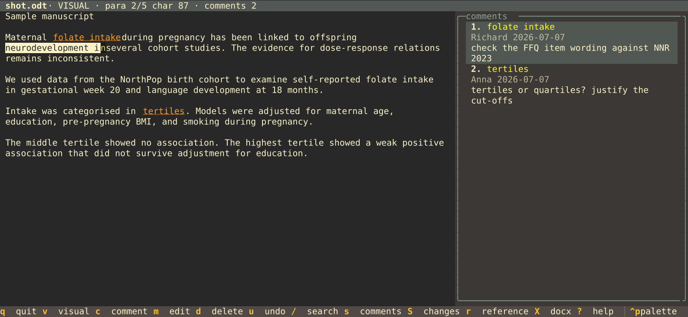

# sidenote

Review Word (docx), LibreOffice (ODT) and Markdown documents entirely from the keyboard. Add comments in a fast terminal UI.

Read a document in a TUI, select any span of text and attach a comment. In
Word and LibreOffice documents the comments are written as native ODF
inline annotations (`office:annotation` + `office:annotation-end`), so they
open as ordinary comments in LibreOffice. Export to docx goes through
headless LibreOffice, which maps annotation ranges to real Word comment
ranges (`commentRangeStart`/`commentRangeEnd`) that co-authors see in Word.

Markdown works differently. The file is left exactly as it is and comments
go to a sidecar JSON file beside it, so the document stays a plain build
input that pandoc reads and git diffs line by line.

No mouse required. Built for reviewing manuscripts on a laptop when for example traveling.



## Install

```sh
pipx install git+https://github.com/Richard-Lundberg-Ulfsdotter/sidenote
```

Or from a clone

```sh
git clone https://github.com/Richard-Lundberg-Ulfsdotter/sidenote
cd sidenote
python -m venv .venv
.venv/bin/pip install -e .
```

Needs Python 3.10+ and, for the docx round-trip, LibreOffice (`soffice`) on
PATH. Everything else is pure Python (odfpy + Textual). Developed on Linux,
should work anywhere Textual and LibreOffice run.

## Usage

```sh
sidenote manuscript.odt              # open the TUI
sidenote manuscript.docx             # docx works too, see below
sidenote manuscript.odt --author "Richard Lundberg-Ulfsdotter"

sidenote manuscript.md               # markdown too, see below
sidenote manuscript.md --refcheck ../reference-check.md

sidenote list manuscript.odt         # print comments
sidenote check manuscript.md         # report orphaned comments
sidenote changes manuscript.odt      # print tracked changes
sidenote add manuscript.odt --para 2 --start 10 --end 24 --text "..."
sidenote export manuscript.odt       # write manuscript.docx next to it
sidenote sample demo.odt             # generate a test document
sidenote sample demo.md              # the same text as markdown
```

The author name defaults to `$SIDENOTE_AUTHOR`, then the login name.

### docx workflow

Opening a `.docx` converts it to a sibling `.odt` working copy via headless
LibreOffice and opens that. Existing Word comments come along. The working
copy is reused on reopening as long as it is newer than the docx, so your
comments are not lost. If you receive a new version of the docx (newer than
the working copy), it is reconverted and the old working copy is replaced.

Exporting (`X` in the TUI, or the `export` subcommand) writes
`<name>.docx` next to the file. When you opened a docx, that is the
original file, so export means "write my comments back into the docx".

### Markdown workflow

Opening a `.md` (also `.markdown`, `.mkd`, `.qmd`, `.rmd`) reviews the file
in place. Paragraphs are the blank-line separated blocks of the source,
shown as they are written, with fenced code blocks kept whole. Comments go
to `<name>.sidenote.json` next to the document. The markdown itself is never
written to, which is the point when it feeds a build or lives under version
control where comment churn would clutter prose diffs.

Comments are stored top to bottom and named for where they sit, so `cmt3`
in the sidecar is the third comment down and the one numbered 3 in the
sidebar. That makes it easy to point an editor, or an AI assistant reading
the JSON, at the comment you are actually looking at. The names are
positions rather than permanent identities, so adding a comment above an
existing one renumbers the ones below it.

Keep the two files together. The sidecar is named after the document, so
moving or renaming the markdown means moving the sidecar with it, and
committing both in one commit gives any past revision a matching set of
prose and comments.

Because the document can be edited outside sidenote, comments are re-found
on open rather than trusting stored offsets. Each end of a comment records
the surrounding wording, so inserting sections above, reflowing paragraphs
and rewriting neighbouring sentences all leave the comment where it belongs,
and a phrase replaced in place carries its comment across. Rewriting the
anchored words together with their surroundings is the case that cannot be
recovered. That comment is marked `orphaned` in the sidebar and kept at its
last known position rather than dropped, and sidenote says so on open.

`sidenote check` prints the same report and exits nonzero when anything is
orphaned, which makes it usable as a pre-commit hook.

```sh
sidenote check manuscript.md || echo "a comment lost its anchor"
```

There is no docx export for markdown. The comments are for reading in the
TUI and in `sidenote list`.

## Keys

| Key            | Action                                        |
| -------------- | --------------------------------------------- |
| `j` `k`        | move down/up one display line                 |
| `h` `l`        | move left/right one character                 |
| `w` `b` `e`    | word start forward/back, word end             |
| `f` `F` + char | jump to next/previous char in the paragraph   |
| `t` `T` + char | jump to just before/after it                  |
| `;` `,`        | repeat the last `f`/`t`, forward/backward     |
| `(` `)`        | previous/next sentence                        |
| `0` `$`        | start/end of display line                     |
| `{` `}`        | previous/next paragraph                       |
| `gg` `G`       | first/last paragraph                          |
| `ctrl+d/u`     | half page down/up                             |
| `ctrl+e/y`     | scroll view one line (cursor stays)           |
| `zz` `zt` `zb` | cursor line to center/top/bottom              |
| `v`            | toggle visual mode (character-level select)   |
| `is` `as`      | select the sentence, without/with its space   |
| `iw` `aw`      | select the word, without/with its space       |
| `ip` `ap`      | select the whole paragraph                    |
| `c`            | comment on selection, or point note at cursor |
| `m`            | edit comment (cursor or sidebar selection)    |
| `d`            | delete comment, confirm with `y`              |
| `u` `ctrl+r`   | undo / redo a comment change                  |
| `]` `[`        | jump to next/previous comment                 |
| `r`            | reference for the citation under the cursor   |
| `/`            | search (smartcase)                            |
| `n` `N`        | next/previous search match (wraps)            |
| `*` `#`        | search word under cursor forward/backward     |
| `s`            | open and focus comments sidebar / close it    |
| `S`            | open and focus tracked-changes panel / close  |
| `>` `<`        | jump to next/previous tracked change          |
| `D`            | show/hide deleted text lines                  |
| `tab`          | switch focus between document and sidebar     |
| `ctrl+←/→`     | move the divider, resizing panel and document |
| `X`            | export to docx (background, not for markdown) |
| `?`            | help (scrolls with `j`/`k`, escape closes)    |
| `escape`       | back to document / leave visual / clear search|
| `q`            | quit                                          |

`f` and `t` search the paragraph rather than the display line, since the
line breaks are only wrapping and move when the pane is resized. The
sentence rule is vim's, a `.`, `!` or `?` with any closing brackets or
quotes after it, then whitespace or the end of the paragraph. Text
objects work from normal mode as well as from visual mode, so `as`
selects the sentence around the cursor and `c` comments on it. They
always take the whole object, both ends of it, wherever in it the
cursor sits. That differs from vim, which extends an existing visual
selection forward only, but selecting from the cursor to the end of
something is what `vf.` and `v)` already do. `ip` and `ap` both take
the whole paragraph, there being no blank lines to include.

Everything is keyboard-driven, no mouse needed. When the sidebar is
focused, `j`/`k`/`g`/`G` move the selection, enter jumps to the
comment's anchor in the document, `m`/`d` act on the selected comment,
and `/` filters the list by author name or comment text
(case-insensitive substring, shown in the sidebar title as
`comments · anna (2/3)`). `n`/`N` cycle through the filtered comments
with wraparound, and `*`/`#` filter to the selected comment's author
and step to that author's next/previous comment. Escape clears the
filter first, then returns to the document. Closing the sidebar also
clears the filter.

With the sidebar open the selection follows the cursor. Moving onto
commented text in the document highlights that comment in the panel and
scrolls it into view, so the note is readable without leaving the
document. Off any comment the last selection stands, and a comment
hidden by an active filter is left alone.

`ctrl+←` and `ctrl+→` move the divider between the document and the open
panel in steps of four columns, and the text rewraps to the new width.
The panel stops at 20 columns and never leaves the document less than 30.
Both panels share the width, so the split stays where you put it when
switching between comments and changes.

Search matches highlight in green with the current match in orange, and
the status bar shows the match position (`/folate 2/5`). `*`/`#` use
whole-word matching, as in vim.

### Reference check

A manuscript written for pandoc carries its citations as keys,
`[@blomhoffNordicNutritionRecommendations2023]`. Put a `reference-check.md`
beside the document and `r` opens an overlay with what that file says about
the citation under the cursor, so the claim can be checked against its
source without leaving the review.

The file is an ordinary Markdown pipe table, one row per citation, with
columns for the statement, the reference key, the supporting quote and a
status. Columns are matched by name rather than position, so extra columns
and different section headings are fine.

```markdown
## 1. Introduction

| Statement                       | Reference                        | Supporting quote                      | Status |
|:--------------------------------|:---------------------------------|:--------------------------------------|:-------|
| Folate reduces neural tube risk | bjorke-monsenFolateScoping2023   | "prevents most cases of spina bifida" | OK     |
| Energy cutoffs are standard     | liMaternalDiet2024; yangDiet2022 | "less than 500 kcal/day"              | OK     |
```

A row naming two keys is found under both.

The overlay shows every row citing that key, so a source used in two places
is checked in one view. Inside a grouped citation like `[@a2020; @b2021]`
the cursor anywhere in the brackets reaches all the keys and `n`/`N` step
between them. `o` opens the full-text PDF, `j`/`k` scroll, escape closes.
The file is re-read on every `r`, so a row added in another window shows up
without reopening the document.

sidenote looks for `reference-check.md` beside the document and up to two
directories above it, `--refcheck` names one explicitly, and
`$SIDENOTE_REFCHECK` sets it for good.

The full texts are found by citation key, `<key>.pdf`. The directory comes
from the check file itself when it documents one, as in

```markdown
- Full texts: `/home/richard/research/references/<key>.pdf`
```

otherwise from `$SIDENOTE_REFERENCES`, otherwise from
`~/research/references`. `$SIDENOTE_PDF_VIEWER` replaces `xdg-open` for
anyone who wants a particular reader.

None of this is required. Without a check file the `r` key just says so,
and everything else works as before.

### Tracked changes

Documents with Word tracked changes show them read-only. Inserted text
renders green inline. Deleted text appears as red struck-through lines
woven in at the spot it was removed (`D` hides and shows them), and a
red underline marks the deletion point in the running text. The
deleted lines are display-only, the cursor skips them and comments
cannot anchor there. The status bar names the change's author when the
cursor is on one, including the deleted text for deletions. `S` opens
a panel listing every insertion and deletion with author, date, and
the affected text, enter jumps to its place in the document, and
`>`/`<` step through changes without the panel. The `changes`
subcommand prints the same list in the terminal. Format-only changes
are not shown, and accepting or rejecting changes stays in LibreOffice
or Word.

Comments save immediately when added, edited, or deleted, to the ODT
itself or to the markdown sidecar.
The comment dialog quotes the full selected text (across paragraphs,
capped at 600 characters) above a multi-line editor, enter inserts a
newline, `ctrl+s` saves, escape cancels.

### Theme

The interface uses gruvbox by default. Any other Textual theme can be
picked with the `TEXTUAL_THEME` environment variable, for example
`TEXTUAL_THEME=nord sidenote paper.odt`.

## Architecture

```
sidenote/
  engine.py   ODT model. Load, plain-text paragraphs, comment anchoring
              at (paragraph, character offset), edit/delete, save,
              docx import and export via headless LibreOffice.
              `open_review()` picks the engine that fits the file.
  markdown.py Markdown model, same interface. Blocks as paragraphs,
              comments in a sidecar JSON file, anchors relocated by
              their surrounding text when the document has moved.
  tui.py      Textual frontend. Vim navigation, text objects, visual
              selection, search, comment modal, sidebar, help. Keeps a
              display-line map back to engine positions. The document
              pane renders only visible lines, so navigation stays
              fast on long documents.
  refcheck.py Reads a manuscript's reference-check.md, indexes its
              table rows by citation key, and locates the full-text
              PDFs. Optional, absent for most documents.
  cli.py      Entry point. TUI plus list/check/add/export/sample
              subcommands.
tests/
  test_engine.py   Round-trip tests including a soffice docx export
                   check that the comment survives as a Word comment.
  test_markdown.py Sidecar round-trips and the re-anchoring cases,
                   including that the markdown is never modified.
  test_refcheck.py Table parsing and citation detection under the
                   cursor, including grouped citations.
```

The engines are deliberately frontend-agnostic and share one interface, so
the TUI and CLI never branch on file format. A future Neovim plugin can call
`open_review()` (or the CLI) without touching the TUI.

Key invariant. Annotation elements contribute zero width to the extracted
plain text, so adding a comment never shifts the character offsets of the
surrounding text. Insertion splits text nodes (and multi-space `text:s`
elements) at the requested offset.

## Known limits

- Tables, footnotes, and frames render as their flattened paragraph text.
- Deleted text is shown on separate display lines, not woven into the
  running sentence. Comments anchored to deleted text are not shown.
- No comment threads or replies (single-level comments, as in ODF).
- No editing of the document text, this is a reviewer, not an editor.
- The docx round-trip goes through LibreOffice, so complex Word layout
  may shift slightly on export. Comments and text survive.
- Markdown is shown as source, not rendered. Offsets then match the file
  you edit, which is what anchoring needs.
- Markdown comments cannot be exported to docx, and a markdown comment
  whose anchor text and surrounding wording are both rewritten is marked
  orphaned rather than relocated.
- The reference overlay reads a hand-maintained check file, not the
  bibliography. It reports what that file says, and says nothing about
  whether the file is up to date with the manuscript.

## Development

```sh
.venv/bin/python -m pytest tests/ -q
.venv/bin/python tools/make_screenshot.py   # redraw docs/screenshot.svg
```

The suite covers the engine round-trips (including a headless LibreOffice
docx export, skipped when `soffice` is missing) and drives the TUI
headlessly through Textual's pilot. CI runs it on Python 3.10 and 3.14.

## License

GPL-3.0-or-later, see [LICENSE](LICENSE). If you distribute a modified
version, you must make its source available under the same terms.
